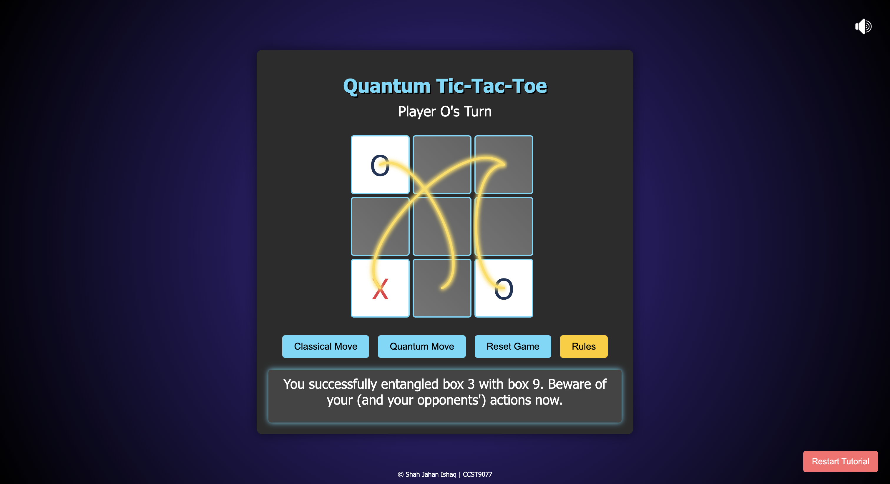

# Quantum Tic-Tac-Toe

**Quantum Tic-Tac-Toe** is a modern twist on the classic Tic-Tac-Toe game, incorporating principles of quantum mechanics to introduce new strategic dimensions. Players engage in a game where each move involves quantum superposition and entanglement, creating a dynamic and intellectually stimulating experience.



## Table of Contents

- [Demo](#demo)
- [Installation](#installation)
- [Usage](#usage)
- [Gameplay Instructions](#gameplay-instructions)
- [Contributing](#contributing)
- [License](#license)
- [Contact](#contact)

## Demo

Check out the live version of Quantum Tic-Tac-Toe [here](https://shahjahanishaq.github.io/quantum-tictactoe/).

## Installation

Quantum Tic-Tac-Toe is a web-based game and does not require any server-side setup. Follow these steps to get started:

1. **Clone the Repository**
    ```bash
    git clone https://github.com/ShahJahanIshaq/quantum-tic-tac-toe.git
    ```

2. **Navigate to the Project Directory**
    ```bash
    cd quantum-tic-tac-toe
    ```

3. **Open the Game in Your Browser**
    - Locate the `index.html` file in the project directory.
    - Double-click the file to open it in your default web browser.

## Usage

Once installed, you can play Quantum Tic-Tac-Toe directly in your web browser. The game is ready to play without any additional configuration.

## Gameplay Instructions

Quantum Tic-Tac-Toe introduces new mechanics into the classic game:

1. **Game Start**
    - Player X begins with a **Classical Move**.

2. **Classical Move**
    - **Action**: Collapse a quantum state into either 'X' or 'O' with equal probability.
    - **Result**: The selected cell changes from a quantum state (superposition of X and O) to a classical state (either X or O).

3. **Quantum Move**
    - **Action**: Entangle a control box (quantum state) with a target box (classical state).
    - **Strategy**: If the control box collapses to the player's favored state during a Classical Move, the target box state inverses (e.g., X becomes O, and vice versa).
    - **Effect**: Creates dependencies that influence the game's progression, adding strategic depth.

4. **Winning Condition**
    - Align three of your marks ('X' or 'O') in a row, column, or diagonal to win the game.

5. **Draw**
    - If all cells are in classical states without any player achieving the winning condition, the game ends in a draw.

## Contributing

Contributions are welcome! Whether you're fixing bugs, improving the tutorial, or adding new features, your input helps make Quantum Tic-Tac-Toe better.

1. **Fork the Repository**
2. **Create a New Branch**
    ```bash
    git checkout -b feature/YourFeatureName
    ```
3. **Commit Your Changes**
    ```bash
    git commit -m "Add Your Feature"
    ```
4. **Push to the Branch**
    ```bash
    git push origin feature/YourFeatureName
    ```
5. **Open a Pull Request**

Please ensure your contributions adhere to the existing code style and include relevant tests if applicable.

## Contact

For any inquiries, feedback, or suggestions, feel free to reach out:

- **Email**: sjishaq@connect.hku.hk
- **GitHub**: [ShahJahanIshaq](https://github.com/ShahJahanIshaq)

---

Happy Playing! 🎮✨